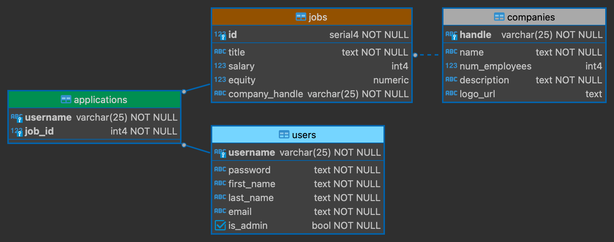

# Jobly Frontend

Jobly is a full featured job board with authentication. Users can browse and apply to active job listings on a standalone page and use the search filter to find a job. A company list page displays all companies in the DB, and each companies page features a list of all posted jobs.

<a href="https://react-jobly-frontend.onrender.com/">Try it out!</a>

# Table of Contents
1. [Features](#Features)
2. [Tech stack](#Tech-stack)
3. [Database schema](#Database-schema)
4. [Install](#Install)
5. [Test](#Test)
6. [Deployment](#Deployment)
7. [Future features](#Future-features)

## Features:
* Logged out users have the option to sign up for an account. Authentication is manged by the backend.
* Logged in users have access to view companies and jobs, apply for jobs, and the option to update their profile.
* Users can apply and unapply for jobs to keep track of application status.
* Search fields are available for users to filter through companies/jobs.
* Token stored on localStorage so that a user is not automatically logged out upon page refresh.
* Alerts are displayed to the user when signing up for an account and editing the user profile if minimum requirements are not met.

## Tech stack:

### Backend ([GitHub Repo](https://github.com/trevorhudson/react-jobly-backend)):

### Frontend ([GitHub Repo](https://github.com/trevorhudson/react-jobly-frontend)):

### Database Management:

### Database Schema::

## Install:

To initialize and seed DB.

    createdb jobly < jobly.sql

This project uses Node.js for the back-end JavaScript runtime environment. To install the backend dependencies from the package.json file:

    npm install

To start the sever (port 3000):

    npm start

## Testing:
To run the tests:

    jest -i

## Deployment:
### Backend Deployment:

We used ElephantSQL and Render to deploy our backend.

Seed your remote database:

    pg_dump -O jobly | psql (YOUR_DATABASE_URL)

In Render, create a new instance of “Web service”.

Choose advanced, and enter environmental variables:

    DATABASE_URL: (YOUR_DATABASE_URL)

    SECRET_KEY: (anything)

## Future features:
* Live search
* Show a list of companies applied to
* Add edit form for companies
* Add job application forms
